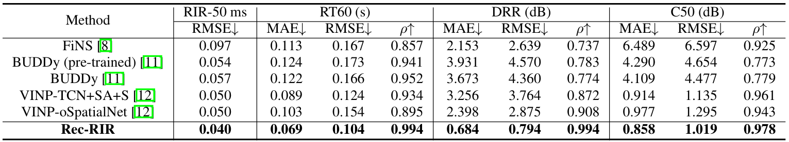
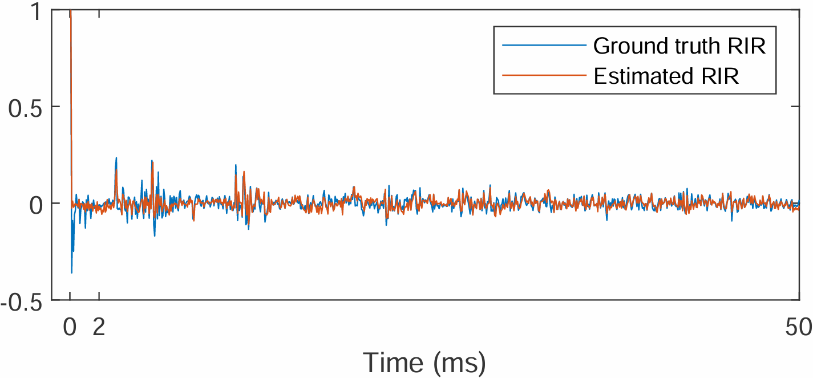

# Rec-RIR

## Introduction
Official PyTorch implementation of 'Rec-RIR: Monaural Blind Room Impulse Response Identification via DNN-based Reverberant Speech Reconstruction in STFT Domain'

[Paper](https://arxiv.org/abs/2509.15628) | [Code](https://github.com/Audio-WestlakeU/Rec-RIR)

Room impulse response (RIR) characterizes the complete propagation process of sound in an enclosed space. This paper presents Rec-RIR for monaural blind RIR identification. Rec-RIR is developed based on the convolutive transfer function (CTF) approximation, which models reverberation effect within narrow-band filter banks in the short-time Fourier transform (STFT) domain. Specifically, we propose a deep neural network (DNN) with cross-band and narrow-band blocks to estimate the CTF filter. The DNN is trained through reconstructing the noise-free reverberant speech spectra. This objective enables stable and straightforward supervised training. Subsequently, a pseudo intrusive measurement process is employed to convert the CTF filter estimate into time-domain RIR by simulating a common intrusive RIR measurement procedure. Experimental results demonstrate that Rec-RIR achieves state-of-the-art (SOTA) performance in both RIR identification and acoustic parameter estimation. 

## Performance

Results


Example


## Quick start
### Prepare dataset
Follow the guidance in [VINP](https://github.com/Audio-WestlakeU/VINP).

### Training

```
# train from scratch
torchrun --standalone --nnodes=1 --nproc_per_node=[number of GPUs] train.py -c config/Rec-RIR.toml -p [saved dirpath]

# resume training
torchrun --standalone --nnodes=1 --nproc_per_node=[number of GPUs] train.py -c config/Rec-RIR.toml -p [saved dirpath] -r 

# use pretrained checkpoints
torchrun --standalone --nnodes=1 --nproc_per_node=[number of GPUs] train.py -c config/Rec-RIR.toml -p [saved dirpath] --start_ckpt [pretrained model filepath]
```

### Inference

**The codes will be released soon.**

## Citation
If you find our work helpful, please cite
```
@misc{wang2025recrirmonauralblindroom,
      title={Rec-RIR: Monaural Blind Room Impulse Response Identification via DNN-based Reverberant Speech Reconstruction in STFT Domain}, 
      author={Pengyu Wang and Xiaofei Li},
      year={2025},
      eprint={2509.15628},
      archivePrefix={arXiv},
      primaryClass={eess.AS},
      url={https://arxiv.org/abs/2509.15628}, 
}
```
Please also consider citing our previous work
```
@misc{wang2025vinpvariationalbayesianinference,
      title={VINP: Variational Bayesian Inference with Neural Speech Prior for Joint ASR-Effective Speech Dereverberation and Blind RIR Identification}, 
      author={Pengyu Wang and Ying Fang and Xiaofei Li},
      year={2025},
      eprint={2502.07205},
      archivePrefix={arXiv},
      primaryClass={eess.AS},
      url={https://arxiv.org/abs/2502.07205}, 
}
```
