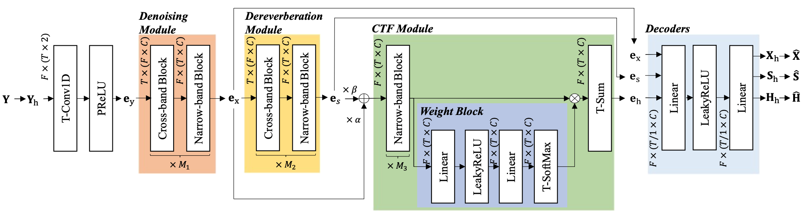
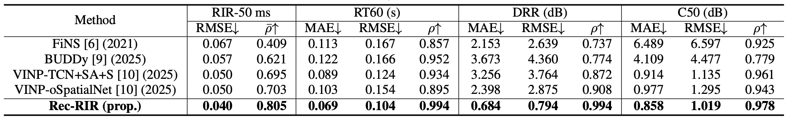
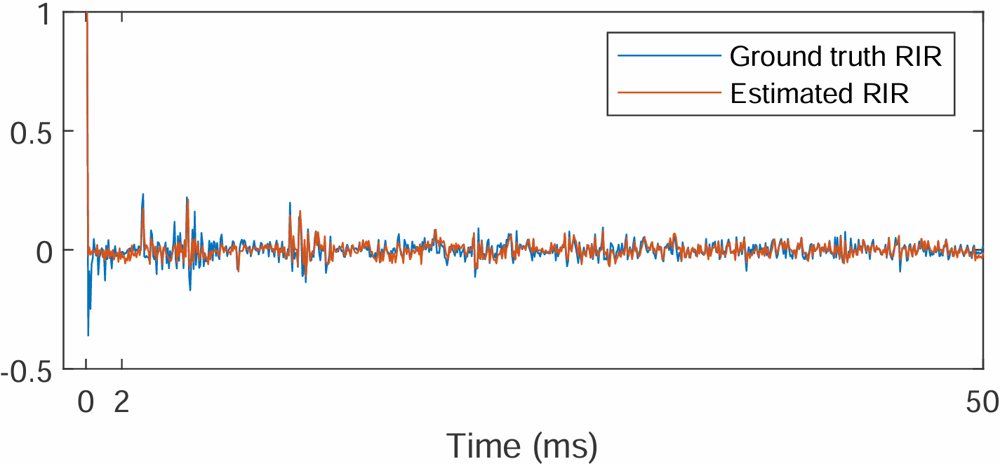

# Rec-RIR

## Introduction
Official PyTorch implementation of '**Blind Room Impulse Response Identification via Reverberant Speech
Spectrum Reconstruction**'[Interspeech 2026]

[Paper](https://arxiv.org/abs/2509.15628) | [Code](https://github.com/Audio-WestlakeU/Rec-RIR)


## Performance

Network architecture



Results



Example



## Quick start
### Prepare dataset
Follow the guidance in [VINP](https://github.com/Audio-WestlakeU/VINP).

### Training

```
# train from scratch
torchrun --standalone --nnodes=1 --nproc_per_node=[number of GPUs] train.py -c config/Rec-RIR.toml -p [saved dirpath]

# resume training
torchrun --standalone --nnodes=1 --nproc_per_node=[number of GPUs] train.py -c config/Rec-RIR.toml -p [saved dirpath] -r 

# use pretrained checkpoints
torchrun --standalone --nnodes=1 --nproc_per_node=[number of GPUs] train.py -c config/Rec-RIR.toml -p [saved dirpath] --start_ckpt ckpt/epoch35.tar
```

### Inference

```
python inference.py -c config/Rec-RIR.toml --ckpt ckpt/epoch35.tar -i [reverberant speech dirpath] -o [output dirpath]
```

## Citation
If you find our work helpful, please cite
```
@misc{wang2025recrirmonauralblindroom,
      title={Rec-RIR: Monaural Blind Room Impulse Response Identification via DNN-based Reverberant Speech Reconstruction in STFT Domain}, 
      author={Pengyu Wang and Xiaofei Li},
      year={2025},
      eprint={2509.15628},
      archivePrefix={arXiv},
      primaryClass={eess.AS},
      url={https://arxiv.org/abs/2509.15628}, 
}
```
Please also consider citing our previous work
```
@ARTICLE{VINP,
  author={Wang, Pengyu and Fang, Ying and Li, Xiaofei},
  journal={IEEE Transactions on Audio, Speech and Language Processing}, 
  title={VINP: Variational Bayesian Inference With Neural Speech Prior for Joint ASR-Effective Speech Dereverberation and Blind RIR Identification}, 
  year={2025},
  volume={33},
  number={},
  pages={4387-4399},
  doi={10.1109/TASLPRO.2025.3622947}}
```
